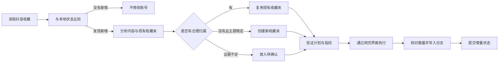

# Douyin Favorites Organizer

把抖音新增收藏按内容自动整理进合适的收藏夹。分类不被固定在最初的几个目录里：如果新内容确实不适合现有分类，系统可以创建新的、可长期复用的公开收藏夹。

> 当前面向 Windows 与已登录的抖音网页版。项目不会读取或保存 Cookie、Token、二维码内容、浏览器 storage 或请求签名，也不会取消收藏、删除收藏夹或调用未公开接口。

## 先看结论：它能做什么

- 读取当前账号的抖音收藏视频。
- 只处理此前没有见过的新增收藏，避免反复整理旧视频。
- 优先复用语义真正匹配的现有收藏夹。
- 没有合理归属时，创建名称清晰、可长期复用的新收藏夹。
- 证据不足、主题过窄或分类冲突时，放入 `待确认`，不强行归类。
- 用计划指纹、审批令牌、执行令牌和本地日志约束账号写入。
- 验证加入收藏夹前后的作品数量，结果不明确时停止，而不是盲目重试。
- 支持在用户明确授权后，通过 Codex 自动化每天增量整理。

## 适合谁

适合：

- 收藏视频越来越多，之后很难找回；
- 希望按内容用途而不是作者姓名整理；
- 需要 AI 根据新内容逐步扩展分类体系；
- 希望自动整理，但不接受取消收藏、删除文件夹或私自读取登录凭证；
- 使用 Windows、Codex，并能保持抖音网页版登录状态。

暂时不适合：

- 需要在手机端后台独立运行；
- 希望绕过登录、验证码或抖音页面限制；
- 收藏数量超过 200 条且要求项目证明完整覆盖；
- 希望自动重命名、合并、拆分或删除历史收藏夹。

## 工作流程



## 当前分类不是固定死的

初次真实整理使用过这些分类：

- `AI视频工作流`
- `剪辑与视觉包装`
- `运营获客与流量`
- `AI工具与自动化`
- `商业创业与变现`
- `编程开源与数据`
- `内容策划与表达`
- `待确认`

它们只是已有收藏形成的当前目录，不是永久白名单。增量运行会按以下顺序判断：

1. 内容与现有收藏夹含义直接匹配时，复用现有收藏夹。
2. 没有诚实的匹配，并且主题清晰、稳定、未来仍可能继续收藏时，新建收藏夹。
3. 证据弱、主题太窄或多个分类同样合理时，进入 `待确认`。

默认的每日自动流程每轮最多新建两个收藏夹，避免目录无上限膨胀。

## 系统要求

- Windows
- Node.js `>= 22.13`
- npm
- `@jackwener/opencli` `1.8.6`（已在项目依赖中固定）
- 已配置可读取收藏的 OpenCLI 抖音适配器
- 已登录的抖音网页版及可用的浏览器桥

## 快速开始

```powershell
git clone https://github.com/codingning/douyin-favorites-organizer.git
Set-Location douyin-favorites-organizer
npm install
npm test
npm run security-scan
```

推荐让 Codex 从仓库根目录读取：

```text
skills/douyin-favorites-organizer/SKILL.md
```

可以直接告诉 Codex：

```text
使用仓库里的 douyin-favorites-organizer Skill，检查我的抖音新增收藏。
先读取现有收藏夹和收藏视频，生成分类计划；没有合理归属时可以提出新的稳定分类。
未经明确授权，不要修改我的抖音账号。
```

## 手动执行：先只读检查

检查当前登录账号和收藏夹，不修改账号：

```powershell
npm run browser-apply -- inspect-folders
```

采集收藏并生成本地运行目录：

```powershell
npm run collect -- --limit 200
```

命令会返回一个 `RUN_DIR`。后续增量准备：

```powershell
npm run incremental -- --run <RUN_DIR>
```

如果 `new_count` 为 `0`，不应继续执行任何账号写入。

有新增时生成种子计划：

```powershell
npm run draft -- --run <RUN_DIR> --folder-visibility public
npm run validate -- --run <RUN_DIR>
npm run preview -- --run <RUN_DIR>
```

`draft` 只是确定性初稿。应由使用该 Skill 的 AI 结合当前收藏夹和真实内容证据修订 `classification-plan.json`，然后再次验证。

## 账号写入为什么有多道门

一次性整理默认需要：

1. 采集与分类；
2. 生成 `preview.md`；
3. 用户批准与计划内容绑定的 approval token；
4. 生成只读 `apply-manifest.json`；
5. 写入前再次确认；
6. 使用与计划指纹绑定的 execution token；
7. 按收藏夹分批执行并逐批验证。

只有用户明确批准了固定范围的周期任务后，自动化才可以在该范围内复用长期授权。超出范围，例如重新分类旧视频、删除或重命名收藏夹、改变现有收藏夹可见性，仍需重新确认。

## 增量状态与运行文件

运行数据保存在被 Git 忽略的目录：

```text
var/
├─ runs/                         每次采集、计划、预览、manifest 和执行日志
└─ state/organizer-state.json    已见视频、分类和最后运行状态
```

完成一轮写入并确认所有新增视频均为 `verified` 或 `unavailable` 后，才能提交状态：

```powershell
npm run commit-state -- --run <RUN_DIR>
```

这避免“账号没有真正改成功，但本地却把视频标成已处理”。

## 安全边界

项目明确禁止：

- 读取、打印或保存 Cookie、Token、二维码、storage state 和请求签名；
- 使用未公开私有接口强制写入；
- 点击 `取消收藏`；
- 自动删除、重命名、合并收藏夹；
- 在提交结果不明确时重复提交；
- 把作者身份、私人信息或一次性事件作为收藏夹分类；
- 因为原有分类方便，就把不合适的内容硬塞进去。

遇到登录失效、验证码、页面结构变化、ID 缺失、数量不符或选择器歧义时，流程会停止并请求人工处理。

## 已验证结果

2026-07-31 的真实账号整理：

- 读取到 43 条收藏记录；
- 39 条在抖音批量管理界面中可定位并完成分类；
- 4 条陈旧或不可管理记录被明确标记为 unavailable；
- 创建并整理 8 个收藏夹，随后全部核验为公开；
- 收藏总数保持 `43 → 43`，缺失 ID 与额外 ID 均为 0。

当前代码验证：

- Node 自动测试：`11/11` 通过；
- Codex Skill 结构校验通过；
- 项目敏感信息扫描通过；
- npm 官方安全审计：0 个已知漏洞；
- 真实只读收藏夹检查可识别账号名称、数量和公开/私密状态。

## 当前限制

- 抖音页面结构变化可能使浏览器适配器暂时失效。
- 采集上限为 200 条；达到上限时不能宣称完整覆盖全部收藏。
- 分类主要依赖当前可获得的标题、作者、标签、转录或画面证据；证据不足时必须降级为 `待确认`。
- “创建新的公开收藏夹”的最新增量路径已通过代码、计划与只读界面验证，但尚未在更新后的版本中用一个全新真实分类完成完整端到端写入复验。
- 定时运行依赖电脑、Codex、浏览器桥和抖音登录状态在执行时可用。

## 常用验证命令

```powershell
npm test
npm run security-scan
npm audit --registry=https://registry.npmjs.org --audit-level=high
node --check scripts/apply-browser.mjs
```

## 许可证

仓库当前公开可见，但尚未提供 `LICENSE` 文件。公开可见不等于自动授予复制、修改或再分发许可。

## 项目地址

<https://github.com/codingning/douyin-favorites-organizer>
